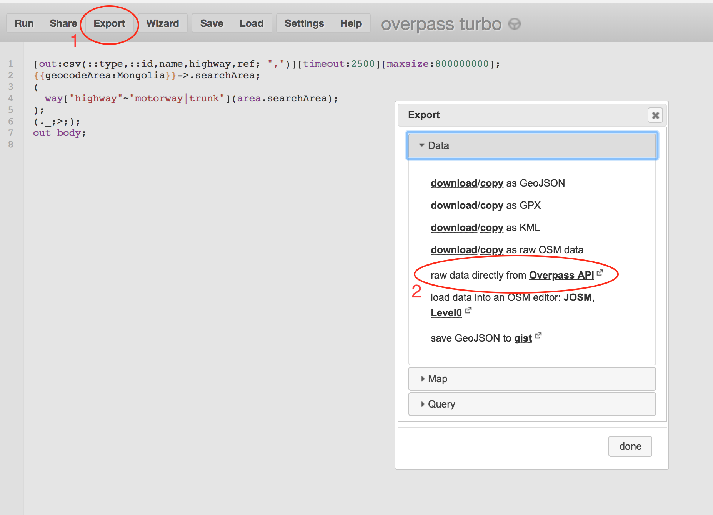

# Chameleon 2


- - -

[](https://gitlab.com/seakaart/chameleon-2/commits/master)

- - -

## Description

Cross-platform GUI development expanding upon Chameleon 1 functionalities. This application compares tabulated OSM data (.csv) and provide users with an output documenting changes between two timestamps. Current functionalities include detecting changes in `ref`, `int_ref`, `name`, and `highway` tags from OSM data. Some metadata OSM tags are default outputs of Chameleon 2, including `type`, `id`, `name`, `user`, `timestamp`, `version`. Chameleon 2 also enables change grouping and multi-analytical capability for processing multiple user options at once. This project is under ongoing development, and Chameleon 2 is currently in Alpha stage.

## Installation

### Dependencies

* [`PyInstaller`](https://github.com/pyinstaller/pyinstaller): 
```bash 
	pip3 install pyinstaller
```
* [`ruamel.yaml`](https://pypi.org/project/ruamel.yaml/): 
```bash 
	pip3 install ruamel.yaml
```
* [`appdirs`](https://pypi.org/project/appdirs/): 
```bash 
	pip3 install appdirs
```

### Mac

1. Clone the repo

```bash
	git clone git@gitlab.com:seakaart/chameleon-2.git
```
2. Install `q` and `pyqt`
	
```bash 
	brew install q pyqt
```

3. Change into the directory

```bash 
	cd chameleon-2/
```

4. Copy and paste the following into the terminal

```bash
 	pyuic5 design.ui -o design.py
```

5. Package Chameleon 2 into application

```bash
 	pyinstaller Chameleon2.spec
```

- - -

## Overpass Turbo

Tabulated OSM data is required for using Chameleon 2. CSVs can be obtained from overpass-turbo.de. Default tags that are used by Chameleon 2 processing includes `type`, `id`, `name`, `user`, `timestamp`, `version`. User will need two snapshots of the OSM data with all of the above-listed tags to process OSM data with Chameleon 2. Overpass Turbo output should be exported using the "raw data directly from <u>Overpass API</u>" option:



 Sample Query for extracting Overpass snapshot OSM data:
 - Modify `[date:"YYYY-MM-DDT00:00:00Z"]` for desire snapshot
 - Modify `{geocodeArea:Country_Name}` for desire location
 - Modify `way["highway"~"motorway|trunk|primary|secondary|tertiary|_link"]` for desire way objects

```
[out:csv(::type,::id,name,::user,::timestamp,::version,highway,ref,int_ref)][timeout:25000][maxsize:800000000][date:"YYYY-MM-DDT00:00:00Z"];
{{geocodeArea:Country_Name}}->.searchArea;
(
  way["highway"~"motorway|trunk|primary|secondary|tertiary|_link"](area.searchArea);
);
out meta;
```
- - -

## Disclaimer
- This version is provided for internal developers and users ONLY.
- DO NOT distribute this tool without approval from developers.
- Public version will be available with future versions of Chameleon.

## Contributors
@austin61293, @dericke, @geografer