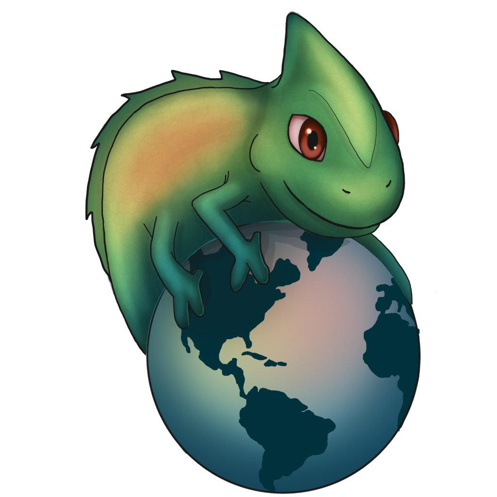
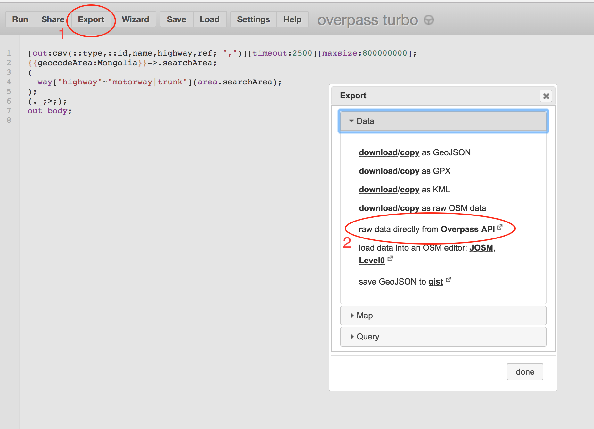
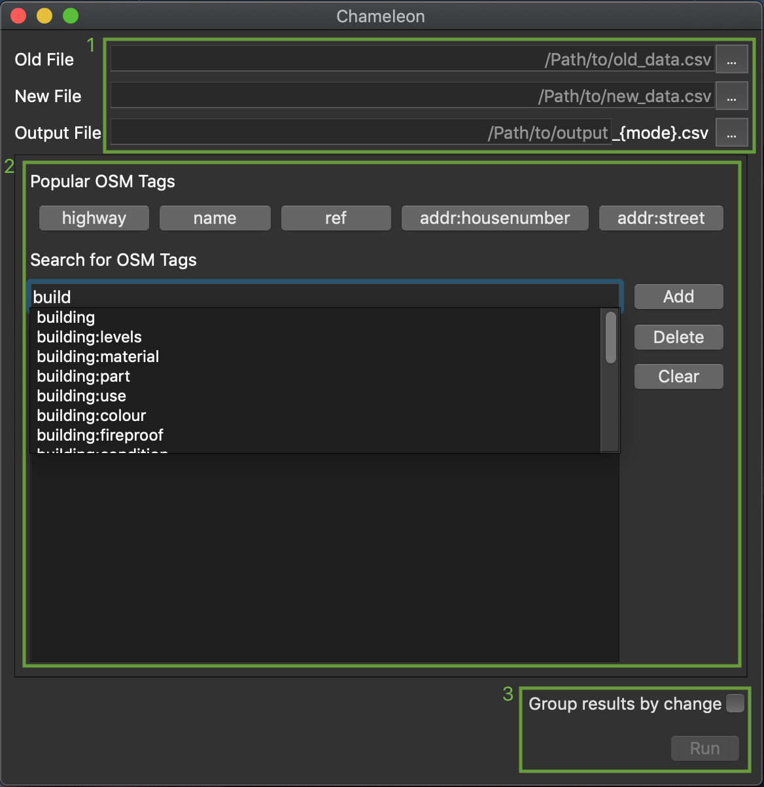

# Chameleon



---

<!-- [](https://gitlab.com/seakaart/chameleon-2/commits/master) -->

[](https://gitlab.com/seakaart/chameleon-2/-/tags)
[](https://gitlab.com/seakaart/chameleon-2/blob/master/LICENSE)

---

## About

Chameleon is an Open Source cross-platform (MacOS, Linux, Windows) OpenStreetMap companion software developed by [`Kaart`](http://kaartgroup.com/) with [`PySide`](https://www.qt.io/qt-for-python) and [`Python`](https://www.python.org/). This application compares tabulated OSM data (.csv) and provide users with an output documenting changes between two timestamps. Current functionalities allows users to compare OSM tags from two snapshots. Some metadata OSM tags are default outputs of Chameleon, including `type`, `id`, `name`, `user`, `timestamp`, `version`. Chameleon also features change grouping (consolidation similar changes for compared tag) and multi-tag processing (sequential tag comparisons).

Chameleon aims to inform OSM editors about changes that occurred in an area from the OSM database. The goal of Chameleon is to engage individual and organized OSM community memebers in collaborative editing.

## Installation

1. Install dependencies: [`PyInstaller`](https://github.com/pyinstaller/pyinstaller), [`yaml`](https://pypi.org/project/pyyaml/), [`appdirs`](https://pypi.org/project/appdirs/), [`PySide`](https://pypi.org/project/pyside6/), [`pandas`](https://pypi.org/project/pandas/):

```bash
	pip3 install pyinstaller pyyaml appdirs PySide6 pandas
```

2. Clone the repo

```bash
	git clone git@github.com:KaartGroup/Chameleon.git
```

3. Change into the directory

```bash
	cd Chameleon/
```

4. Run `initialize.py` to generate some neccessary files and the self-contained executable

```bash
	./initialize.py
```

5.  Find the executable in the `dist` directory

## Overpass Turbo

Tabulated OSM data (.csv) is required for Chameleon. OSM data snapshots can be obtained from [`Overpass Turbo`](https://overpass-turbo.eu/). Default tags that are needed for Chameleon processing include `type`, `id`, `name`, `user`, `timestamp`, `version`. Users will need acquire the two snapshots of OSM data with all of the above-listed tags to compare OSM data with Chameleon. With Overpass Turbo, output should be exported using the "**raw data directly from Overpass API**" option:



Sample Query for extracting Overpass snapshot OSM data:

-   Modify `[date:"YYYY-MM-DDT00:00:00Z"]` for desired snapshot.
-   Modify `{geocodeArea:LOCATION}` for desired location.
-   Modify `way["building"]` for desired OSM objects.

```
[out:csv(::type,::id,name,::user,::timestamp,::version,highway,ref,int_ref)][timeout:250][date:"YYYY-MM-DDT00:00:00Z"];
{{geocodeArea:LOCATION}}->.searchArea;
(
  way["building"](area.searchArea);
);
out meta;
```

## Using Chameleon



#### Step 1: Provide the file directories

Chameleon requires OSM data snapshots to perform the analysis. Simply navigate or drag in your file options for **Old** and **New** snapshots. Then specify an **Output** location for the summaries to be generated. Note that there is an editable and noneditable portion of the **Output** field. Chameleon will append whatever you type with the name of the mode analyzed and a `.csv` suffix. For example, typing `/home/me/Documents/peru` into this field might give output files like `/home/me/Documents/peru_highway.csv` and `/home/me/Documents/peru_name.csv`, depending on which tags are selected in the next step.

#### Step 2: Input tag comparisons

Provide the tags you would like to compare. Tags can be entered either from the **Popular OSM Tags** buttons or the search bar. As you use Chameleon, your most-frequently-used tags will automatically replace the defaults on the five buttons.

#### Step 3: Grouping by change

Decide whether or not to **group** the changes by type of change. For example, with the box checked and while analyzing a `ref` tag, all ways that had a ref tag changed from **“I 5”** to **“I 90”** would be grouped together into one row in the output CSV, with a count of how many ways are in the group, a list of editors who last edited the ways in the group, the datestamp of the last edit to a member of the group, and a link to load the whole group into JOSM. Ways where **“I 5”** was removed entirely would appear in a different row.

#### Step 4: Run

Hit **Run** to generate your output CSVs.

## Interpreting Output

Chameleon provides a list of defaulted column headers with the output. A comprehensive list of definition for the output columns can be found below! The purpose of the Chameleon output is to inform OSM mappers about how the area they are trying to map has changed, and by identifying the change, one can collaborate with other mappers in the area more effectively.

### Output Table Headers

-   `id` (OSM object ID)
-   `url` (JOSM remote control)
-   `user` (OSM username)
-   `timestamp` (Last edited date)
-   `old_tag` (Tag value from older snapshot)
-   `new_tag` (Tag value from newer snapshot)
-   `action` (How has the object changed?)
-   `notes` (Empty column for Chameleon user)
-   `count` (only with grouping enabled, sum of objects with identical change)

## Help and Particpate

-   Submit bugs and requests through our [`issue`](https://github.com/KaartGroup/Chameleon/issues) page!
-   Fork the [`Chameleon`](https://github.com/KaartGroup/Chameleon) repository, make changes and then make a [`pull`](https://github.com/KaartGroup/Chameleon/pulls) request!

## License

Chameleon is licensed under **GNU General Public LIcense V3.0**. More details can be found in [`LICENSE`](https://github.com/KaartGroup/Chameleon/blob/master/LICENSE).

## Contributors

The Kaart development team will like to thank everyone for using and contributing to the development of Chameleon.

Initial development by @austin61293, @dericke, @geografer and @LiuTwo

Logo designed by @sammi1
