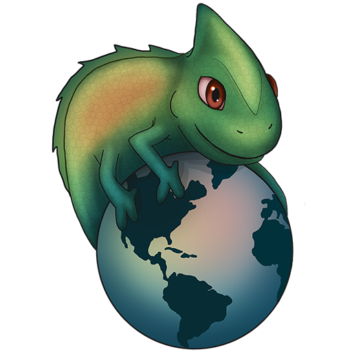

# Chameleon


- - -

[](https://gitlab.com/seakaart/chameleon-2/commits/master)
[](https://gitlab.com/seakaart/chameleon-2/-/tags)
[](https://gitlab.com/seakaart/chameleon-2/blob/master/LICENSE)

- - -

## About

Chameleon is an Open Source cross-platform (MacOS, Linux, Windows) OpenStreetMap companion software developed by [`Kaart`](http://kaartgroup.com/) with [`PyQt5`](https://www.riverbankcomputing.com/software/pyqt/intro) and [`Python`](https://www.python.org/). This application compares tabulated OSM data (.csv) and provide users with an output documenting changes between two timestamps. Current functionalities allows users to compare OSM tags from two snapshots. Some metadata OSM tags are default outputs of Chameleon, including `type`, `id`, `name`, `user`, `timestamp`, `version`. Chameleon also features change grouping (consolidation similar changes for compared tag) and multi-tag processing (sequential tag comparisons).

Chameleon aims to inform OSM editors about changes that occurred in an area from the OSM database. The goal of Chameleon is to engage individual and organized OSM community memebers in collaborative editing.

## Installation

### Dependencies

* [`PyInstaller`](https://github.com/pyinstaller/pyinstaller):
```bash
	pip3 install pyinstaller
```
* [`oyaml`](https://pypi.org/project/oyaml/):
```bash
	pip3 install oyaml
```
* [`appdirs`](https://pypi.org/project/appdirs/):
```bash
	pip3 install appdirs
```

### Mac

1. Clone the repo

```bash
	git clone git@gitlab.com:seakaart/chameleon-2.git
```
2. Install `pyqt`

```bash
	brew install pyqt
```

3. Change into the directory

```bash
	cd chameleon-2/
```

4. Copy and paste the following into the terminal

```bash
 	pyuic5 chameleon/design.ui -o chameleon/design.py
```

5. Package Chameleon into application

```bash
 	pyinstaller Chameleon.spec
```

## Overpass Turbo

Tabulated OSM data (.csv) is required for Chameleon. OSM data snapshots can be obtained from [`Overpass Turbo`](https://overpass-turbo.eu/). Default tags that are needed for Chameleon processing include `type`, `id`, `name`, `user`, `timestamp`, `version`. Users will need acquire the two snapshots of OSM data with all of the above-listed tags to compare OSM data with Chameleon. With Overpass Turbo, output should be exported using the "**raw data directly from Overpass API**" option:


 Sample Query for extracting Overpass snapshot OSM data:
 - Modify `[date:"YYYY-MM-DDT00:00:00Z"]` for desire snapshot.
 - Modify `{geocodeArea:LOCATION}` for desire location.
 - Modify `way["building"]` for desired OSM objects.

```
[out:csv(::type,::id,name,::user,::timestamp,::version,highway,ref,int_ref)][timeout:250][date:"YYYY-MM-DDT00:00:00Z"];
{{geocodeArea:LOCATION}}->.searchArea;
(
  way["building"](area.searchArea);
);
out meta;
```

## Using Chameleon


#### Step 1: Provide the file directories
Chameleon requires OSM data snapshots to perform the analysis. Simply navigate or drag in your file options for **Old** and **New** snapshots. Then specify an **Output** location for the summaries to be generated.

#### Step 2: Input tag comparisons
Provide the tags you would like to compare. Tags can be entered either from the **Popular OSM Tags** buttons or the search bar. Tags that have been provied will show up on the list!

#### Step 3: Finalize analysis
Decided whether or not to **group** the changes and simply hit **Run**.

## Help and Particpate
- Submit bugs and requests through our [`issue`](https://gitlab.com/seakaart/chameleon-2/issues) page!
- Fork the [`Chameleon`](https://gitlab.com/seakaart/chameleon-2) repository, make changes and then make a [`pull/merge`](https://gitlab.com/seakaart/chameleon-2/merge_requests) request!

## License
Chameleon is licensed under **GNU General Public LIcense V3.0**. More details can be found in [`LICENSE`](https://gitlab.com/seakaart/chameleon-2/blob/master/LICENSE).

## Contributors
The Kaart development team will like to thank everyone for using and contributing to the development of Chameleon.

Initial Development by @austin61293, @dericke, @geografer and @LiuTwo
Logo designed by @sammi1